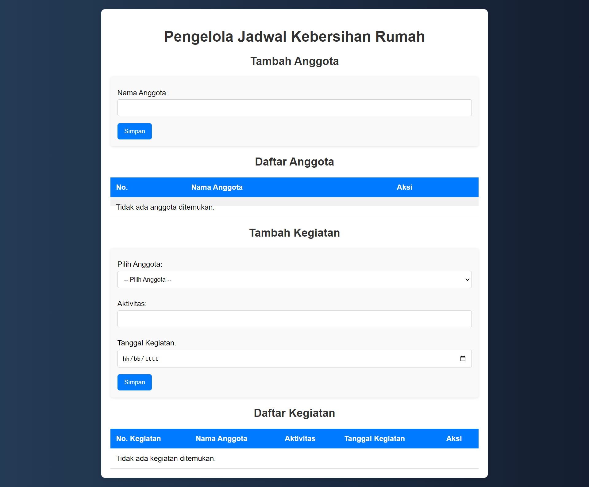

# Aplikasi Pengelolaan Jadwal Kebersihan Rumah

Aplikasi ini digunakan untuk mengelola anggota dan kegiatan dalam jadwal kebersihan rumah. Setiap anggota dapat ditambahkan ke dalam daftar, kemudian diberikan tanggung jawab kegiatan kebersihan pada tanggal tertentu. Aplikasi ini mendukung CRUD (Create, Read, Update, Delete) untuk anggota dan kegiatan yang terintegrasi dengan database MySQL.

# Fitur Utama
1. Tambah Anggota - Pengguna dapat menambah anggota baru ke dalam sistem.
1. Tambah Kegiatan - Setiap anggota dapat dijadwalkan untuk kegiatan tertentu dengan tanggal yang    ditentukan.
1. Edit Anggota dan Kegiatan - Data anggota dan kegiatan dapat diedit jika terjadi perubahan.
1. Hapus Anggota dan Kegiatan - Pengguna dapat menghapus anggota atau kegiatan dari sistem.
1. Daftar Anggota - Daftar semua anggota ditampilkan dalam tabel.
1. Daftar Kegiatan - Daftar semua kegiatan yang terkait dengan anggota ditampilkan dalam tabel.